```mermaid
erDiagram
  %% =========
  %% Users / Auth / Devices
  %% =========
  USERS ||--|| USER_SETTINGS : "settings"
  USERS ||--o{ USER_IDENTITIES : "auth link"
  USERS ||--o{ USER_DEVICES : "device"
  USER_DEVICES ||--o{ USER_SESSIONS : "session"
  USERS ||--o{ USER_SESSIONS : "session"
  USERS ||--o{ TRANSFER_TOKENS : "transfer issued"
  USER_DEVICES ||--o{ TRANSFER_TOKENS : "issued device"
  USER_DEVICES ||--o{ TRANSFER_TOKENS : "used device"

  %% =========
  %% Tasks / Tags
  %% =========
  USERS ||--o{ TASKS : "create task"
  TASKS ||--|| TASK_COMPLETIONS : "complete(once)"
  USERS ||--o{ TASK_COMPLETIONS : "complete"
  USERS ||--o{ TAGS : "create tag"
  TASKS ||--o{ TASK_TAGS : "link"
  TAGS  ||--o{ TASK_TAGS : "link"

  %% =========
  %% Balloons
  %% =========
  USERS ||--o{ BALLOONS : "create user balloon"
  USERS ||--o{ BALLOON_MEMBERSHIPS : "join"
  BALLOONS ||--o{ BALLOON_MEMBERSHIPS : "members"

  USERS ||--o{ BALLOON_SELECTIONS : "select"
  BALLOONS ||--o{ BALLOON_SELECTIONS : "selected"

  %% Progress / Ledger / Pop
  BALLOONS ||--o{ BALLOON_PROGRESS : "progress"
  USERS ||--o{ CONTRIBUTION_LEDGER : "add(actor)"
  BALLOONS ||--o{ CONTRIBUTION_LEDGER : "add target"
  TASKS ||--o{ CONTRIBUTION_LEDGER : "add source(task)"

  BALLOONS ||--o{ BALLOON_POP_HISTORY : "pop history"
  USERS ||--o{ BALLOON_POP_HISTORY : "trigger"

  %% Reports
  USERS ||--o{ BALLOON_REPORTS : "report"
  BALLOONS ||--o{ BALLOON_REPORTS : "reported"

  %% =========
  %% Guerrilla
  %% =========
  GUERRILLA_EVENTS ||--o{ BALLOON_EVENT_LINKS : "target"
  BALLOONS ||--o{ BALLOON_EVENT_LINKS : "target"

  %% =======================
  %% TABLE DEFINITIONS
  %% =======================

  USERS {
    UUID id PK "User ID"
    varchar handle "Handle name"
    smallint plan "Plan(1:FREE 2:PRO)"
    boolean is_guest "Guest"
    smallint auth_state "Auth state(1:GUEST 2:LINKED 3:DISABLED)"
    timestamptz created_at "Created"
    timestamptz updated_at "Updated"
    timestamptz last_login_at "Last login"
    timestamptz deleted_at "Deleted"
  }

  USER_SETTINGS {
    UUID user_id PK,FK "User ID"
    char country_code "Country code"
    smallint render_quality "Render quality(1:AUTO 2:NORMAL 3:LOW)"
    boolean auto_low_power "Auto low on power save"
    timestamptz updated_at "Updated"
  }

  USER_IDENTITIES {
    UUID id PK "Auth link ID"
    UUID user_id FK "User ID"
    smallint provider "1:APPLE 2:GOOGLE 3:ANON"
    varchar provider_user_id "External user ID"
    varchar email "Email"
    boolean email_verified "Email verified"
    timestamptz linked_at "Linked"
    timestamptz last_used_at "Last used"
  }

  USER_DEVICES {
    UUID id PK "Device ID"
    UUID user_id FK "User ID"
    varchar device_fingerprint "Device identifier"
    varchar device_name "Device name"
    smallint platform "1:iOS 2:Android 3:Web"
    varchar app_version "App version"
    varchar os_version "OS version"
    timestamptz created_at "Registered"
    timestamptz last_seen_at "Last used"
  }

  USER_SESSIONS {
    UUID id PK "Session ID"
    UUID user_id FK "User ID"
    UUID device_id FK "Device ID"
    text refresh_token_hash "RT hash"
    timestamptz created_at "Created"
    timestamptz last_used_at "Last used"
    timestamptz revoked_at "Revoked"
  }

  TRANSFER_TOKENS {
    UUID id PK "Transfer ID"
    UUID user_id FK "User ID"
    UUID issued_device_id FK "Issued device ID"
    text token_hash "Token hash"
    timestamptz expires_at "Expires"
    timestamptz used_at "Used"
    UUID used_by_device_id FK "Used device ID"
    timestamptz created_at "Created"
  }

  TASKS {
    UUID id PK "Task ID"
    UUID user_id FK "Creator user ID"
    varchar title "Task name"
    text memo "Memo (optional)"
    timestamptz due_at "Due"
    smallint state "State(1:ACTIVE 2:COMPLETED 3:HIDDEN 4:EXPIRED)"
    boolean is_pinned "Pinned"
    timestamptz completed_at "Completed"
    timestamptz hidden_at "Hidden"
    timestamptz expired_at "Expired"
    timestamptz created_at "Created"
    timestamptz updated_at "Updated"
    timestamptz deleted_at "Deleted"
  }

  TASK_COMPLETIONS {
    UUID id PK "Completion history ID"
    UUID task_id FK "Task ID(unique)"
    UUID user_id FK "Completed user ID"
    timestamptz completed_at "Completed"
  }

  TAGS {
    UUID id PK "Tag ID"
    UUID user_id FK "User ID"
    varchar name "Tag name"
    timestamptz created_at "Created"
  }

  TASK_TAGS {
    UUID task_id PK,FK "Task ID"
    UUID tag_id PK,FK "Tag ID"
  }

  BALLOONS {
    UUID id PK "Balloon ID"
    smallint balloon_type "1:GLOBAL 2:LOCATION 3:BREATHING 4:USER 5:GUERRILLA"
    smallint display_group "1:PINNED 2:DRIFTING"
    smallint visibility "1:SYSTEM 2:PRIVATE 3:PUBLIC"
    UUID owner_user_id FK "Creator user ID(USER only)"
    varchar title "Title"
    varchar description "Description"
    smallint color_id "Color ID"
    smallint tag_icon_id "Icon ID"
    char country_code "Country code(LOCATION)"
    boolean is_active "Active"
    timestamptz created_at "Created"
    timestamptz updated_at "Updated"
  }

  BALLOON_MEMBERSHIPS {
    UUID id PK "Membership ID"
    UUID user_id FK "User ID"
    UUID balloon_id FK "Balloon ID"
    timestamptz joined_at "Joined"
    timestamptz left_at "Left"
    timestamptz created_at "Created"
  }

  BALLOON_SELECTIONS {
    UUID user_id PK,FK "User ID"
    UUID balloon_id PK,FK "Balloon ID"
    int priority "Priority"
    timestamptz selected_at "Selected"
    timestamptz left_at "Deselected"
  }

  BALLOON_PROGRESS {
    UUID id PK "Progress ID"
    UUID balloon_id FK "Balloon ID"
    smallint unit_type "1:USER 2:COUNTRY 3:GLOBAL 4:UTC_DAY 5:EVENT"
    varchar unit_key "Aggregation key"
    int current_value "Current value"
    int next_threshold "Next threshold"
    int break_count "Pop count"
    int lock_version "Lock"
    timestamptz updated_at "Updated"
  }

  CONTRIBUTION_LEDGER {
    UUID id PK "Addition ID"
    UUID actor_user_id FK "Actor user ID"
    UUID balloon_id FK "Target balloon ID"
    smallint unit_type "Aggregation unit"
    varchar unit_key "Aggregation key"
    smallint source_type "1:TASK 2:BREATH 3:SYSTEM 4:ADMIN"
    UUID source_id "Source ID"
    int amount "Amount"
    timestamptz created_at "Added"
  }

  BALLOON_POP_HISTORY {
    UUID id PK "Pop history ID"
    UUID balloon_id FK "Balloon ID"
    smallint unit_type "Aggregation unit"
    varchar unit_key "Aggregation key"
    UUID trigger_user_id FK "Trigger user ID"
    timestamptz popped_at "Popped"
    int threshold_at_pop "Threshold at pop"
    int consumed "Consumed"
    smallint context_type "1:TASK 2:BREATH 3:OTHER"
    UUID context_id "Context ID"
  }

  BALLOON_REPORTS {
    UUID id PK "Report ID"
    UUID reporter_user_id FK "Reporter user ID"
    UUID balloon_id FK "Target balloon ID"
    smallint reason_type "Reason"
    varchar comment "Comment"
    smallint status "Status"
    timestamptz created_at "Reported"
    timestamptz resolved_at "Resolved"
  }

  GUERRILLA_EVENTS {
    UUID id PK "Event ID"
    date tasbal_day "UTC date"
    timestamptz starts_at "Start"
    timestamptz ends_at "End"
    smallint source "1:AUTO 2:ADMIN"
    int priority "Priority"
    timestamptz created_at "Created"
  }

  BALLOON_EVENT_LINKS {
    UUID event_id PK,FK "Event ID"
    UUID balloon_id PK,FK "Balloon ID"
  }
```

# Tasbal ER Diagram (Integrated Version - Category Starting from 1)

> Created: 2026-01-04
> Format: Mermaid `erDiagram`
> Policy:
> - **All category, type, and status codes start from 1**
> - 0 is not used (reserved for future expansion/invalid value detection)

---



---

## Category Operation Rules Summary

- **All start from 1**
- **0 is not used**
- Match Enum / Const / Category Master / Excel Definition / DB CHECK exactly
- Screen control and branching must always be based on category values (no string comparison)

---

## Task State Category (TASK_STATE)

| Value | Name | Description |
|---|------|------|
| 1 | ACTIVE | Normal state (not completed) |
| 2 | COMPLETED | Completed |
| 3 | HIDDEN | Hidden (user hidden) |
| 4 | EXPIRED | Expired (auto-archived) |

### State Transitions

```
ACTIVE ──(complete)──> COMPLETED
ACTIVE ──(hide)──> HIDDEN
ACTIVE ──(expired)──> EXPIRED
COMPLETED ──(uncomplete)──> ACTIVE
HIDDEN ──(unhide)──> ACTIVE
```

### Pinned (is_pinned)

- Pinning is an attribute independent of state
- Only effective for ACTIVE, COMPLETED states
- Pinning is ignored for HIDDEN, EXPIRED states
