```mermaid
erDiagram
  %% =========
  %% Users / Auth / Devices
  %% =========
  USERS ||--|| USER_SETTINGS : "設定"
  USERS ||--o{ USER_IDENTITIES : "認証リンク"
  USERS ||--o{ USER_DEVICES : "端末"
  USER_DEVICES ||--o{ USER_SESSIONS : "セッション"
  USERS ||--o{ USER_SESSIONS : "セッション"
  USERS ||--o{ TRANSFER_TOKENS : "引き継ぎ発行"
  USER_DEVICES ||--o{ TRANSFER_TOKENS : "発行端末"
  USER_DEVICES ||--o{ TRANSFER_TOKENS : "使用端末"

  %% =========
  %% Tasks / Tags
  %% =========
  USERS ||--o{ TASKS : "タスク作成"
  TASKS ||--|| TASK_COMPLETIONS : "完了(1回)"
  USERS ||--o{ TASK_COMPLETIONS : "完了"
  USERS ||--o{ TAGS : "タグ作成"
  TASKS ||--o{ TASK_TAGS : "紐付"
  TAGS  ||--o{ TASK_TAGS : "紐付"

  %% =========
  %% Balloons
  %% =========
  USERS ||--o{ BALLOONS : "ユーザー風船作成"
  USERS ||--o{ BALLOON_MEMBERSHIPS : "参加"
  BALLOONS ||--o{ BALLOON_MEMBERSHIPS : "参加者"

  USERS ||--o{ BALLOON_SELECTIONS : "選択"
  BALLOONS ||--o{ BALLOON_SELECTIONS : "選択される"

  %% Progress / Ledger / Pop
  BALLOONS ||--o{ BALLOON_PROGRESS : "進捗"
  USERS ||--o{ CONTRIBUTION_LEDGER : "加算(実行者)"
  BALLOONS ||--o{ CONTRIBUTION_LEDGER : "加算先"
  TASKS ||--o{ CONTRIBUTION_LEDGER : "加算元(タスク)"

  BALLOONS ||--o{ BALLOON_POP_HISTORY : "割れ履歴"
  USERS ||--o{ BALLOON_POP_HISTORY : "トリガー"

  %% Reports
  USERS ||--o{ BALLOON_REPORTS : "通報"
  BALLOONS ||--o{ BALLOON_REPORTS : "通報対象"

  %% =========
  %% Guerrilla
  %% =========
  GUERRILLA_EVENTS ||--o{ BALLOON_EVENT_LINKS : "対象"
  BALLOONS ||--o{ BALLOON_EVENT_LINKS : "対象"

  %% =======================
  %% TABLE DEFINITIONS
  %% =======================

  USERS {
    UUID id PK "ユーザーID"
    varchar handle "ハンドル名"
    smallint plan "プラン(1:FREE 2:PRO)"
    boolean is_guest "ゲスト"
    smallint auth_state "認証状態(1:GUEST 2:LINKED 3:DISABLED)"
    timestamptz created_at "作成日時"
    timestamptz updated_at "更新日時"
    timestamptz last_login_at "最終ログイン"
    timestamptz deleted_at "削除日時"
  }

  USER_SETTINGS {
    UUID user_id PK,FK "ユーザーID"
    char country_code "国コード"
    smallint render_quality "描画品質(1:AUTO 2:NORMAL 3:LOW)"
    boolean auto_low_power "省電力時自動Low"
    timestamptz updated_at "更新日時"
  }

  USER_IDENTITIES {
    UUID id PK "認証リンクID"
    UUID user_id FK "ユーザーID"
    smallint provider "1:APPLE 2:GOOGLE 3:ANON"
    varchar provider_user_id "外部ユーザーID"
    varchar email "メール"
    boolean email_verified "メール確認"
    timestamptz linked_at "連携日時"
    timestamptz last_used_at "最終使用"
  }

  USER_DEVICES {
    UUID id PK "端末ID"
    UUID user_id FK "ユーザーID"
    varchar device_fingerprint "端末識別子"
    varchar device_name "端末名"
    smallint platform "1:iOS 2:Android 3:Web"
    varchar app_version "アプリ版"
    varchar os_version "OS版"
    timestamptz created_at "登録日時"
    timestamptz last_seen_at "最終利用"
  }

  USER_SESSIONS {
    UUID id PK "セッションID"
    UUID user_id FK "ユーザーID"
    UUID device_id FK "端末ID"
    text refresh_token_hash "RTハッシュ"
    timestamptz created_at "作成日時"
    timestamptz last_used_at "最終使用"
    timestamptz revoked_at "失効日時"
  }

  TRANSFER_TOKENS {
    UUID id PK "引き継ぎID"
    UUID user_id FK "ユーザーID"
    UUID issued_device_id FK "発行端末ID"
    text token_hash "トークンハッシュ"
    timestamptz expires_at "有効期限"
    timestamptz used_at "使用日時"
    UUID used_by_device_id FK "使用端末ID"
    timestamptz created_at "作成日時"
  }

  TASKS {
    UUID id PK "タスクID"
    UUID user_id FK "作成ユーザーID"
    varchar title "タスク名"
    text memo "メモ（任意）"
    timestamptz due_at "期限日時"
    smallint state "状態(1:ACTIVE 2:COMPLETED 3:HIDDEN 4:EXPIRED)"
    boolean is_pinned "ピン留め"
    timestamptz completed_at "完了日時"
    timestamptz hidden_at "非表示日時"
    timestamptz expired_at "期限切れ日時"
    timestamptz created_at "作成日時"
    timestamptz updated_at "更新日時"
    timestamptz deleted_at "削除日時"
  }

  TASK_COMPLETIONS {
    UUID id PK "完了履歴ID"
    UUID task_id FK "タスクID(一意)"
    UUID user_id FK "完了ユーザーID"
    timestamptz completed_at "完了日時"
  }

  TAGS {
    UUID id PK "タグID"
    UUID user_id FK "ユーザーID"
    varchar name "タグ名"
    timestamptz created_at "作成日時"
  }

  TASK_TAGS {
    UUID task_id PK,FK "タスクID"
    UUID tag_id PK,FK "タグID"
  }

  BALLOONS {
    UUID id PK "風船ID"
    smallint balloon_type "1:GLOBAL 2:LOCATION 3:BREATHING 4:USER 5:GUERRILLA"
    smallint display_group "1:PINNED 2:DRIFTING"
    smallint visibility "1:SYSTEM 2:PRIVATE 3:PUBLIC"
    UUID owner_user_id FK "作成ユーザーID(USERのみ)"
    varchar title "タイトル"
    varchar description "説明文"
    smallint color_id "色ID"
    smallint tag_icon_id "アイコンID"
    char country_code "国コード(LOCATION)"
    boolean is_active "有効"
    timestamptz created_at "作成日時"
    timestamptz updated_at "更新日時"
  }

  BALLOON_MEMBERSHIPS {
    UUID id PK "参加ID"
    UUID user_id FK "ユーザーID"
    UUID balloon_id FK "風船ID"
    timestamptz joined_at "参加開始"
    timestamptz left_at "退出"
    timestamptz created_at "作成日時"
  }

  BALLOON_SELECTIONS {
    UUID user_id PK,FK "ユーザーID"
    UUID balloon_id PK,FK "風船ID"
    int priority "優先度"
    timestamptz selected_at "選択日時"
    timestamptz left_at "解除日時"
  }

  BALLOON_PROGRESS {
    UUID id PK "進捗ID"
    UUID balloon_id FK "風船ID"
    smallint unit_type "1:USER 2:COUNTRY 3:GLOBAL 4:UTC_DAY 5:EVENT"
    varchar unit_key "集計キー"
    int current_value "現在値"
    int next_threshold "次回必要量"
    int break_count "割れ回数"
    int lock_version "ロック"
    timestamptz updated_at "更新日時"
  }

  CONTRIBUTION_LEDGER {
    UUID id PK "加算ID"
    UUID actor_user_id FK "実行ユーザーID"
    UUID balloon_id FK "加算先風船ID"
    smallint unit_type "集計単位"
    varchar unit_key "集計キー"
    smallint source_type "1:TASK 2:BREATH 3:SYSTEM 4:ADMIN"
    UUID source_id "加算元ID"
    int amount "加算量"
    timestamptz created_at "加算日時"
  }

  BALLOON_POP_HISTORY {
    UUID id PK "割れ履歴ID"
    UUID balloon_id FK "風船ID"
    smallint unit_type "集計単位"
    varchar unit_key "集計キー"
    UUID trigger_user_id FK "トリガーユーザーID"
    timestamptz popped_at "割れ日時"
    int threshold_at_pop "割れ必要量"
    int consumed "消費量"
    smallint context_type "1:TASK 2:BREATH 3:OTHER"
    UUID context_id "要因ID"
  }

  BALLOON_REPORTS {
    UUID id PK "通報ID"
    UUID reporter_user_id FK "通報ユーザーID"
    UUID balloon_id FK "対象風船ID"
    smallint reason_type "理由"
    varchar comment "補足"
    smallint status "状態"
    timestamptz created_at "通報日時"
    timestamptz resolved_at "対応完了"
  }

  GUERRILLA_EVENTS {
    UUID id PK "イベントID"
    date tasbal_day "UTC日付"
    timestamptz starts_at "開始"
    timestamptz ends_at "終了"
    smallint source "1:AUTO 2:ADMIN"
    int priority "優先度"
    timestamptz created_at "作成日時"
  }

  BALLOON_EVENT_LINKS {
    UUID event_id PK,FK "イベントID"
    UUID balloon_id PK,FK "風船ID"
  }
```

# タスバル ER図（統合版・区分1始まり）

> 生成日: 2026-01-04  
> 形式: Mermaid `erDiagram`  
> 方針:
> - **区分・種別・状態コードはすべて 1 始まり**
> - 0 は未使用（将来拡張・不正値検出用）

---



---

## 区分運用ルールまとめ

- **すべて 1 始まり**
- **0 は使用しない**
- Enum / Const / 区分マスタ / Excel 定義 / DB CHECK を完全一致させる
- 画面制御・分岐は必ず区分値ベースで行う（文字列比較しない）

---

## タスク状態区分（TASK_STATE）

| 値 | 名称 | 説明 |
|---|------|------|
| 1 | ACTIVE | 通常状態（未完了） |
| 2 | COMPLETED | 完了 |
| 3 | HIDDEN | 非表示（ユーザーが非表示に設定） |
| 4 | EXPIRED | 期限切れ（自動アーカイブ） |

### 状態遷移

```
ACTIVE ──(完了)──> COMPLETED
ACTIVE ──(非表示)──> HIDDEN
ACTIVE ──(期限切れ)──> EXPIRED
COMPLETED ──(完了取消)──> ACTIVE
HIDDEN ──(再表示)──> ACTIVE
```

### ピン留め（is_pinned）

- ピン留めは状態とは独立した属性
- ACTIVE, COMPLETED 状態でのみ有効
- HIDDEN, EXPIRED 状態ではピン留めは無視される

